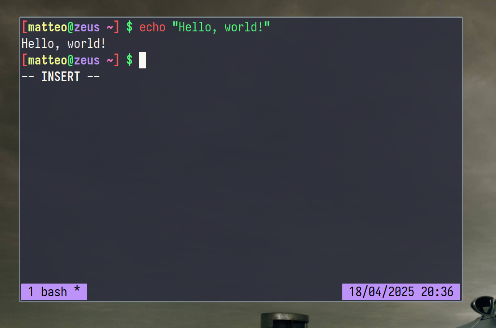

## st

This [st](https://st.suckless.org) build is based off of [Luke Smith's build](https://github.com/LukeSmithxyz/st).
I have applied my own patches.

NOTE: this version will stay at 0.8.2.

Default fonts:
  - Iosevka Curly (size 30)
  - Emojis: JoyPixels (size 30)

Patch features:
  - Added `ALTKEY`;
  - Bell Volume set to 50;
  - Change alpha with <kbd>Super</kbd>+<kbd>Shift</kbd>+<kbd>A</kbd>/<kbd>S</kbd>;
  - Copy with <kbd>Alt</kbd>+<kbd>C</kbd>, Paste with <kbd>Alt</kbd>+<kbd>V</kbd>;
  - `CopyOutput` now uses <kbd>Alt</kbd>+<kbd>Ctrl</kbd>+<kbd>O</kbd>;
  - `CopyUrlCmd` now uses <kbd>Alt</kbd>+<kbd>Ctrl</kbd>+<kbd>Y</kbd>;
  - `MODKEY` changed to <kbd>Super</kbd>;
  - Modified `TERMMOD` to <kbd>Super</kbd>+<kbd>Shift</kbd>;
  - `OpenUrlCmd` now uses <kbd>Alt</kbd>+<kbd>Shift</kbd>+<kbd>L</kbd>.
